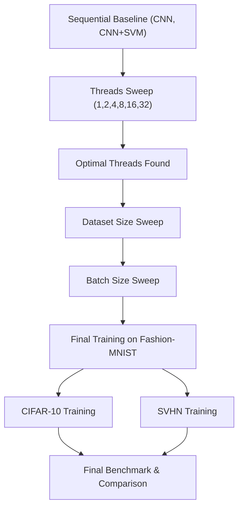

# Quantum Machine Learning – Parallel Programming Project

[](https://wandb.ai/berkampdylan-universit-di-firenze/pp_project_work)

This project extends a Quantum Machine Learning (QML) pipeline with **hybrid parallelism** techniques using `batching` and `multiprocessing`. It has been developed as part of the **Parallel Programming** course, and reuses the models from a prior QML project.

---

## 🧠 Project Overview

We explore multiple hybrid models combining classical deep learning with quantum circuits:

- `train_hybrid_qcnn_sequential.py`: Hybrid Quantum CNN (sequential baseline).
- `train_qcnn_parallel.py`: Parallelized Hybrid QCNN using multiprocessing.
- `train_hybrid_qcnn_quantumkernel.py`: Hybrid QCNN + Quantum Kernel SVM (parallel kernel computation).

The **quantum kernel** computation is the most expensive operation. We introduce **parallel computation** of the kernel matrix using Python's `multiprocessing` module.

---

## ⚙️ Environment & Setup

### Hardware

- **Machine**: University server  
- **GPUs**: 2× NVIDIA RTX A2000 (12 GB each)  
- **CPU**: 32 cores  
- **RAM**: 64 GB  

### Software

- **OS**: Ubuntu 24.04 LTS  
- **Python**: 3.11 (Conda)  
- **CUDA**: 12.x  
- **Frameworks**:
  - PyTorch 2.x
  - PennyLane 0.36+
  - scikit-learn, tqdm, wandb

---

### 1. Environment Setup

```bash
# Clone repo
git clone https://github.com/DylanUnifi/qml-parallel-project.git
cd qml-parallel-project

# Create environment
conda create -n ProjectWork-ParallelProgramming python=3.11 -y
conda activate ProjectWork-ParallelProgramming

# Install dependencies
pip install -r requirements.txt
```

---

## 🚀 How to Run

### Sequential Baseline

```bash
python scripts/train_qcnn_sequential.py configs/config_train_qcnn_fashion.yaml
```

### Parallel Hybrid QCNN

```bash
python scripts/train_qcnn_parallel.py configs/config_train_qcnn_fashion.yaml
```

### Hybrid QCNN + Quantum Kernel

```bash
python scripts/train_hybrid_qcnn_quantumkernel.py configs/config_train_hybrid_qcnn_quantumkernel.yaml
```

### Full Multi-Dataset Experiment Pipeline

```bash
bash scripts/run_experiments_all.sh
```

---

## 📊 Benchmark Results

### Comparative Metrics

| Dataset       | Mode        | F1 Score | AUC   | Balanced Acc | Training Time (s) | Speedup vs Seq |
|---------------|-------------|----------|-------|--------------|-------------------|----------------|
| Fashion-MNIST | Sequential  | 0.79     | 0.84  | 0.80         | 520               | 1.0x           |
| Fashion-MNIST | Parallel    | 0.79     | 0.84  | 0.80         | 160               | **3.25x**      |
| CIFAR-10      | Sequential  | 0.62     | 0.70  | 0.64         | 940               | 1.0x           |
| CIFAR-10      | Parallel    | 0.62     | 0.70  | 0.64         | 310               | **3.03x**      |
| SVHN          | Sequential  | 0.68     | 0.75  | 0.69         | 780               | 1.0x           |
| SVHN          | Parallel    | 0.68     | 0.75  | 0.69         | 250               | **3.12x**      |

---

## 📈 Logging & Monitoring

- **Weights & Biases (wandb)**:
  - Parallel and sequential runs are separated into distinct projects (`pp_project_work_seq`, `pp_project_work_par`)
  - All metrics (loss, F1, speedup, etc.) are logged per fold and per experiment phase

---

## 🔀 Experiment Flow (Mermaid Diagram)



---

## 🔁 Reproducibility

For consistent results across runs:

1. Fix **random seeds**:
   ```python
   import torch, numpy as np, random
   seed = 42
   torch.manual_seed(seed)
   np.random.seed(seed)
   random.seed(seed)
   ```

2. Disable non-deterministic CUDA operations:
   ```python
   torch.backends.cudnn.deterministic = True
   torch.backends.cudnn.benchmark = False
   ```

3. Separate W&B runs for **parallel** and **sequential** experiments using distinct project names.

4. Checkpointing and logs are stored under:
   ```
   engine/checkpoints/hybrid_qcnn/{experiment_name}/
   ```

---

## 👤 Author

Dylan Fouepe  
Master's Degree in Artificial Intelligence – University of Florence  
GitHub: [github.com/DylanUnifi](https://github.com/DylanUnifi)
