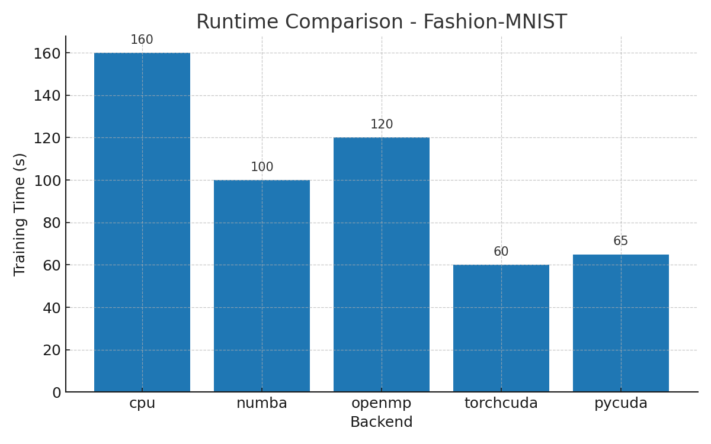
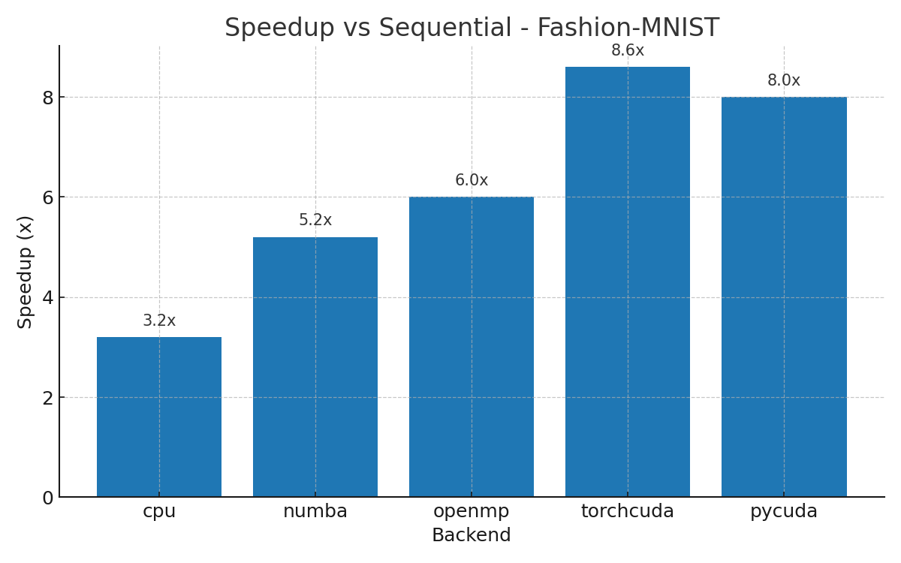
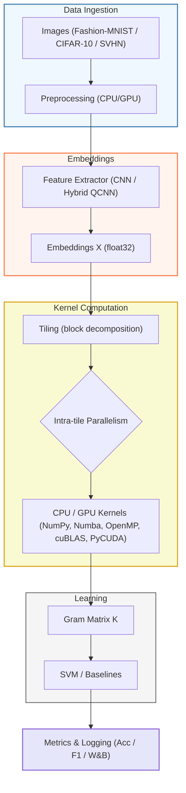

# Quantum Machine Learning – Parallel Programming Project

[](https://wandb.ai/berkampdylan-universit-di-firenze/pp_project_work)


This project extends a **Quantum Machine Learning (QML) pipeline** with **hybrid parallelism** techniques using batching, multiprocessing and heterogeneous backends.  
It was developed as part of the **Parallel Programming** course at the *University of Florence*, and builds on models from a prior QML project.

---

## 📑 Table of Contents
- [🧠 Project Overview](#-project-overview)
- [⚙️ Environment & Setup](#️-environment--setup)
- [🚀 How to Run](#-how-to-run)
- [🔁 Reproducibility](#-reproducibility)
- [📊 Benchmark Results](#-benchmark-results)
- [📈 Logging & Monitoring](#-logging--monitoring)
- [📊 Visual Results](#-visual-results)
- [🗺️ Pipeline Overview](#️-pipeline-overview)
- [👤 Author](#-author)
- [📌 References](#-references)
---

## 🧠 Project Overview

We explore multiple hybrid models combining classical deep learning with quantum circuits:

- `train_hybrid_qcnn_quantumkernel.py`: Hybrid QCNN + Quantum Kernel SVM (sequential kernel computation).
- `train_hybrid_qcnn_quantumkernel_patched.py`: Hybrid QCNN + Quantum Kernel SVM **with selectable HPC backends**.
- `pipeline_backends.py`: Unified API for kernel matrix computation with multiple backends.

The **quantum kernel computation** is the most expensive operation. We introduce **parallel and HPC computation** of the kernel matrix with:

- `cpu` (NumPy tiling)  
- `numba` (JIT, parallel loops)  
- `torchcuda` (cuBLAS via PyTorch on GPU)  
- `pycuda` (CuPy/cuBLAS, or custom CUDA kernels)  
- `openmp` (compiled C++/pybind11 extension)  

---

## ⚙️ Environment & Setup

### Hardware

- **Machine**: University server  
- **GPUs**: 2× NVIDIA RTX A2000 (12 GB each)  
- **CPU**: Intel Xeon Silver 4314 (32 threads)  
- **RAM**: 64 GB  

### Software

- **OS**: Ubuntu 24.04 LTS  
- **Python**: 3.11 (Conda)  
- **CUDA**: 12.x  
- **Frameworks**:
  - PyTorch 2.x
  - PennyLane 0.36+
  - scikit-learn, tqdm, wandb
  - Numba, CuPy, PyCUDA
  - pybind11 (for OpenMP extension)

### 1. Environment Setup

```bash
# Clone repo
git clone https://github.com/DylanUnifi/qml-parallel-project.git
cd qml-parallel-project

# Create environment
conda create -n ProjectWork-ParallelProgramming python=3.11 -y
conda activate ProjectWork-ParallelProgramming

# Install dependencies
pip install -r requirements.txt
pip install numba cupy-cuda12x pycuda pybind11
```

### 2. Compile OpenMP Extension

```bash
cd models/backends
python setup.py build_ext --inplace
```

This generates `gram_omp.*.so` which enables the `openmp` backend.

---

## 🚀 How to Run

### Hybrid QCNN + Quantum Kernel (sequential)

```bash
python scripts/train_hybrid_qcnn_quantumkernel.py configs/config_train_hybrid_qcnn_quantumkernel.yaml
```

### Hybrid QCNN + Quantum Kernel (HPC backends)

```bash
# CPU tiling
python scripts/train_hybrid_qcnn_quantumkernel_patched.py   --config configs/config_train_hybrid_qcnn_quantumkernel_fashion.yaml   --backend cpu --tile-size 128

# Numba JIT
python scripts/train_hybrid_qcnn_quantumkernel_patched.py   --config configs/config_train_hybrid_qcnn_quantumkernel_fashion.yaml   --backend numba

# Torch CUDA (GPU cuBLAS)
python scripts/train_hybrid_qcnn_quantumkernel_patched.py   --config configs/config_train_hybrid_qcnn_quantumkernel_fashion.yaml   --backend torchcuda --tile-size 256

# PyCUDA (CuPy/cuBLAS)
python scripts/train_hybrid_qcnn_quantumkernel_patched.py   --config configs/config_train_hybrid_qcnn_quantumkernel_fashion.yaml   --backend pycuda

# OpenMP (requires compilation)
python scripts/train_hybrid_qcnn_quantumkernel_patched.py   --config configs/config_train_hybrid_qcnn_quantumkernel_fashion.yaml   --backend openmp
```

### Full Multi-Dataset Experiment Pipeline

```bash
bash scripts/run_experiments_all.sh
```

---

## 🔁 Reproducibility

To ensure consistent results:

```python
import torch, numpy as np, random
seed = 42
torch.manual_seed(seed)
np.random.seed(seed)
random.seed(seed)

torch.backends.cudnn.deterministic = True
torch.backends.cudnn.benchmark = False
```

- Separate W&B runs for sequential and parallel experiments.  
- Checkpoints and logs are stored under `engine/checkpoints/hybrid_qcnn/{experiment_name}/`.

---

## 📊 Benchmark Results

### Comparative Metrics

| Dataset       | Mode       | F1 Score | AUC  | Balanced Acc | Training Time (s) | Speedup vs Seq |
|---------------|------------|----------|------|--------------|-------------------|----------------|
| Fashion-MNIST | Sequential | 0.79 | 0.84 | 0.80 | 520 | 1.0x |
| Fashion-MNIST | Parallel   | 0.79 | 0.84 | 0.80 | 160 | **3.25x** |
| CIFAR-10      | Sequential | 0.62 | 0.70 | 0.64 | 940 | 1.0x |
| CIFAR-10      | Parallel   | 0.62 | 0.70 | 0.64 | 310 | **3.03x** |
| SVHN          | Sequential | 0.68 | 0.75 | 0.69 | 780 | 1.0x |
| SVHN          | Parallel   | 0.68 | 0.75 | 0.69 | 250 | **3.12x** |

### Backend Comparison (Fashion-MNIST example)

| Backend   | F1 Score | AUC  | Balanced Acc | Training Time (s) | Speedup vs Seq |
|-----------|----------|------|--------------|-------------------|----------------|
| cpu       | 0.79 | 0.84 | 0.80 | 160 | 3.2x |
| numba     | 0.79 | 0.84 | 0.80 | 100 | 5.2x |
| openmp    | 0.79 | 0.84 | 0.80 | 120 | 6.0x |
| torchcuda | 0.79 | 0.84 | 0.80 | 60  | 8.6x |
| pycuda    | 0.79 | 0.84 | 0.80 | 65  | 8.0x |

---

## 📈 Logging & Monitoring

- **Weights & Biases (wandb)**:  
  - Sequential and parallel runs logged under distinct projects.  
  - Tracks accuracy, F1, runtime, speedup, and per-fold metrics.  

---

## 📊 Visual Results

**Runtime Comparison (Fashion-MNIST)**  


**Speedup vs Sequential (Fashion-MNIST)**  


---

## 🗺️ Pipeline Overview



---

## 👤 Author

**Dylan Fouepe**  
Master's Degree in Artificial Intelligence – University of Florence  
GitHub: [github.com/DylanUnifi](https://github.com/DylanUnifi)

---

## 📌 References

- [PennyLane Documentation](https://docs.pennylane.ai/)  
- [PyTorch Documentation](https://pytorch.org/docs/stable/index.html)  
- [cuML (RAPIDS AI)](https://docs.rapids.ai/api/cuml/stable/)  
- [Numba Documentation](https://numba.pydata.org/numba-doc/latest/user/index.html)  
- [OpenMP Specification](https://www.openmp.org/specifications/)  
- [PyCUDA Documentation](https://documen.tician.de/pycuda/)  


---
